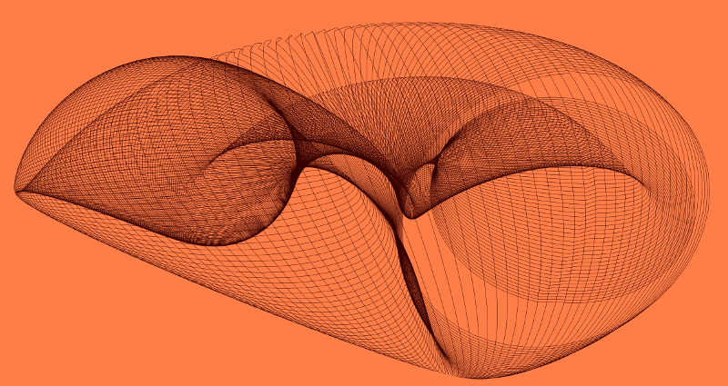

# Lines from rules

How little is needed to create a visual composition? this course will focus on how to obtain generative forms with the smallest amount of code possible.

You, your keyboard and the quest for the smallest set of instruction that draws on a computer screen.

> If you can’t explain it simply, you don’t understand it well enough.

*Albert Einstein*

## First week assignement

Create a sketch using your favourite creative coding framework (Processing, openFrameworks, three.js, paper.js, p5.js, nannou, you name it), using only 5 lines of code.

- Read the wikipedia article on [Rubber Duck Debugging](https://en.wikipedia.org/wiki/Rubber_duck_debugging).
- Write down on a piece of paper what each line is doing, as you were explain your code to a rubber duck.
- Propose 3 variations of your sketch. For each variation write down what did you change and how it affects the visual output.

P.S.
- The 5 lines of code have to be in the `draw` method. Any code related to resources inizialization, like the code that in an openFrameworks application goes into the `ofApp.h` file, or that one that in Processing goes into the `setup` method, does not count.
- Each line can not be longer than 80 chars, space included.

## References

[The Minimalist Manifesto](http://atc.berkeley.edu/201/readings/judd-so.pdf), by Donald Judd.

[Grapefruit](https://en.wikipedia.org/wiki/Grapefruit_(book)), by Yoko Ono.

[Wall Drawings](https://solvingsol.com/), by Sol LeWitt.

[Line Describing a cone](https://vimeo.com/155042007), by Anthony McCall.

[ASDFG](https://vimeo.com/10009063), by Jodi.

