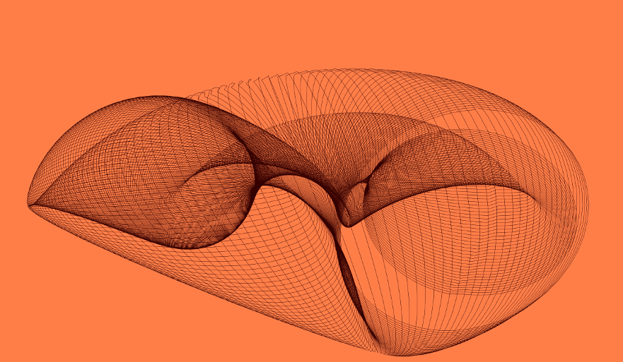

# Lines from rules

How little is needed to create a visual composition? How many lines of code are necessary to make an interactive installation? this course focuses on maximize efforts, how to obtain the best result with the smallest amount of code possible.
The students will code sets of rules and instructions to draw lines, to blink leds or to activate servomotors, with a particular eye on simplicity and readability.

> If you can’t explain it simply, you don’t understand it well enough.

*Albert Einstein*

## First week assignement

Create a sketch using your favourite creative coding framework (Processing, openFrameworks, three.js, paper.js, p5.js, nannou, arduino IDE, you name it), using only 5 lines of code.

- Read the wikipedia article on [Rubber Duck Debugging](https://en.wikipedia.org/wiki/Rubber_duck_debugging).
- Write down on a piece of paper what each line is doing, as you were explaining your code to a rubber duck.
- Make 3 variations of your sketch.
- Pick one that one that you like mostly. You will polish it and make it presentable the 23 of October.

P.S.
- The 5 lines of code have to be in the `draw` method, or in the `loop` method if you are working with Arduino. Any code related to resources inizialization, like the code that in an openFrameworks application goes into the `ofApp.h` file, does not count. The same applies for the code that in Processing and in Arduino goes into the `setup` method.

- Each line can not be longer than 80 chars, spaces included.

### References

[The Minimalist Manifesto](http://atc.berkeley.edu/201/readings/judd-so.pdf), by Donald Judd.

[Grapefruit](https://en.wikipedia.org/wiki/Grapefruit_(book)), by Yoko Ono.

[Wall Drawings 1](http://radicalart.info/concept/LeWitt/), [2](https://massmoca.org/sol-lewitt/), [3](https://solvingsol.com/) by Sol LeWitt.

[The conditional design manifesto](https://conditionaldesign.org/manifesto/)

[Line Describing a cone](https://vimeo.com/155042007), by Anthony McCall.

[ASDFG](https://vimeo.com/10009063), by Jodi.

## 30 October. The Grid

Rules of the day:
- Make a grid. Start with a small grid, like 30x30. Make it bigger later.
- Initialize each cell of the grid with a value. It can be whatever, a color, a number, a sound, a string, a led turned on or a switch button.
- Invent 3 rules for which each cell interacts with the other cells and eventually change. Those 3 rules can not be espressed in more than 5 lines of code, each line of code can not be longer than 80 chars. (from now on, we will refer to this last rule as `the 5 LOC rule`).

### References

- [cellular automata](https://en.wikipedia.org/wiki/Cellular_automaton)
- [Daniel Shiffman video](https://www.youtube.com/watch?v=DKGodqDs9sA)
- [Rule 110](https://en.wikipedia.org/wiki/Rule_110)
- [Rule 90](https://en.wikipedia.org/wiki/Rule_90)
- [Brian's Brain](https://en.wikipedia.org/wiki/Brian%27s_Brain)
- [Game of life](https://en.wikipedia.org/wiki/Conway%27s_Game_of_Life)
- [Von Neumann cellular automaton](https://en.wikipedia.org/wiki/Von_Neumann_cellular_automaton)
- [Alexander Galloway on Nils Barricelli](http://cultureandcommunication.org/galloway/pdf/Galloway-Creative_Evolution-Cabinet_Magazine.pdf)
- [Nils Barricelli on Dataisnature](https://www.dataisnature.com/?p=1448)
- [George Dyson: The birth of the computer](https://www.youtube.com/watch?v=EF692dBzWAs)
- [George Dyson, Darwin among the machines](https://www.edge.org/conversation/george_dyson-darwin-among-the-machines-or-the-origins-of-artificial-life)

## 6 November. The Grid, but without cells.

Let's make a step back and let's remove the cells from the grid. Consider a grid simply as a defined number of lines, not necessary of the same with, crossing each other at a certain angle.

Rules of the day pt. 1:
- You have to use lines.
- Each line have to be a bit different from the others.
- Animate the grid.

Rules of the day pt. 2:
- You can use just circles, or square or triangles.
- Animate the grid.
- Use at least 4 colors, black and white are not allowed.

## 13 and 20 November. Accumulation, repetition, overlapping

Rules of the day:
- Define a system in which you can represent 0 or a finite number of elements.
- The total number of elements in your system grows as times goes by.
- At a given limit, your system is reset, and the total number of element goes to 0.
- Respect the `5 LOC Rule`

### References
- [yayoi kusama accumulation series](https://www.google.com/search?q=yayoi+kusama+accumulation+series&client=firefox-b-d&source=lnms)
- [Tara Donovan](https://en.wikipedia.org/wiki/Tara_Donovan), [2](https://www.studiointernational.com/index.php/tara-donovan-interview-compositions-cards)
- [Wolfgang Laib’s Pollen from Hazelnut ](https://www.moma.org/calendar/exhibitions/1315)
- [Katamari Damacy](https://www.youtube.com/watch?v=JHsFcSNFUMc)

## 27 November & 4 December. Landscapes

Rules of the day:
- Create an abstract landscape, details are not important, try to give a sense of depth.
- You can use just two colors.
- Respect the `5 LOC Rule`.

### References

- [Daniel Brown, Travelling by Numbers](http:// ic.kr/s/aHskyNR2Tz)
- [Fractional noise mountains Mandelbrot and Richard F. Voss](http:// www.wired.com/2013/01/mandelbrot-images/)
- [In Jared Tarbell’s classic Substrate](http://www.complexication.net/gallery/machines/substrate/)
- [Everest Pipkin,Mirror Lake](http://katierose.itch.io/mirrorlake)
- [Kristyn Janae Solie’s Lonely Planets](http://www.kyttenjanae.com/)

<!--  ## 11 and 18 December. The smallest neural network. -->

